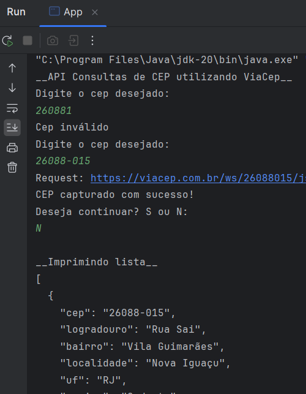
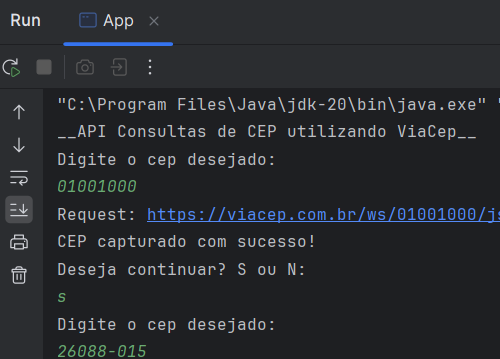

##  🔎 Busca CEPs via Api pública da ViaCEP

O projeto tem como objetivo retornar consultas de CEPs utilizando a API pública do ViaCep e retornando um arquivo Json.

No site da [ViaCEP](https://viacep.com.br/), que é um Webservice gratuito para consulta de Código de Endereçamento Postal (CEP) do Brasil, você terá acesso à documentação da API utilizada.

Biblioteca utilizada: [Gson](https://mvnrepository.com/artifact/com.google.code.gson/gson) do Google. Gson é uma biblioteca Java que pode ser usada para converter objetos Java em sua representação JSON. Também pode ser usado para converter uma string JSON em um objeto Java equivalente.

## Funcionamento
- O programa faz uma validação se o tamanho do campo for menor ou maior que 8 dígitos,

  
- O programa aceita o CEP com ou sem hífen. 

 
